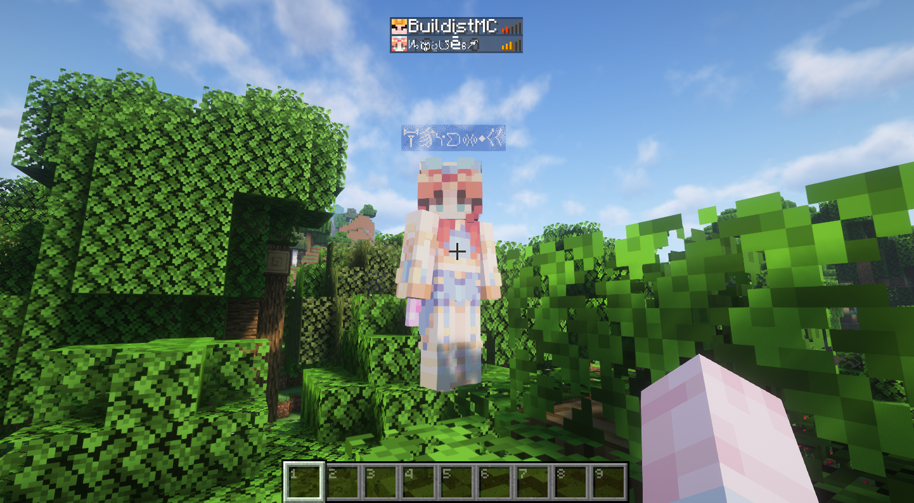
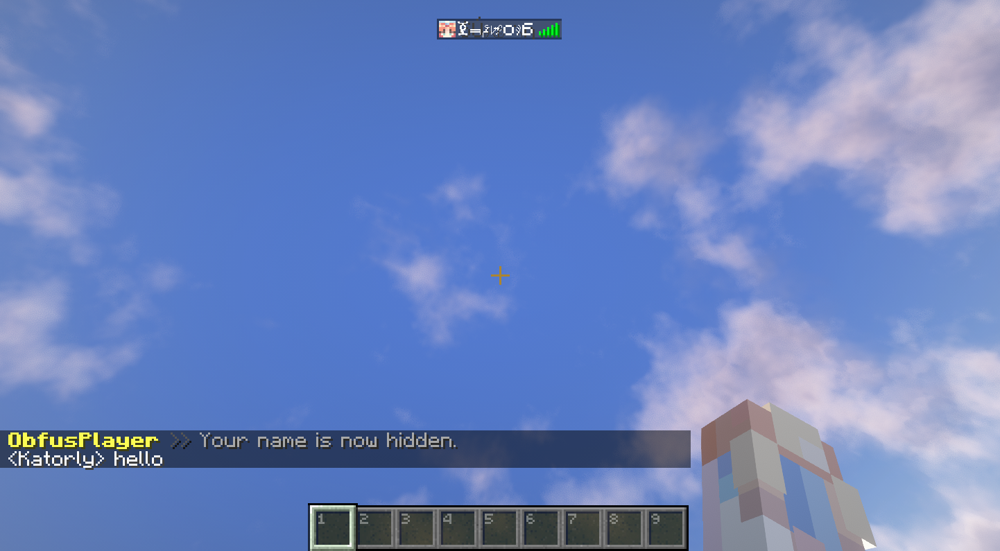

<h1 align="center">ObfusPlayer</h1>
<p align="center">One sentence to describe your plugin.<br><br>
<a href="https://mozilla.org/MPL/2.0"></a> <a href="https://github.com/katorlys/ObfusPlayer/releases/latest"></a> <a href="https://github.com/katorlys/ObfusPlayer/actions/workflows/build.yml"></a> <a href="https://github.com/katorlys/ObfusPlayer/pulls"></a> <a href="https://github.com/katorlys/ObfusPlayer/issues"></a></p>

## Introduction
A simple Spigot 1.20.4 plugin to obfuscate players' name tag on their head and their names from tab list.

  
Will obfuscate player's name tag and their name from tab list.  

  
Will not obfuscate player's name in chat.  

## Commands
- `/hide [on|off]` Toggle obfuscation for player's name tag and their name from tab list.

## Permissions
- `obfusplayer.use` To use `/hide` command.

## Compile
```shell
./gradlew shadowJar
```

## Notice
- Test before reviewing. Please don't leave bad reviews if you dislike it.
- If you find a bug, still don't know how to use the plugin, or have new features to suggest, make sure you're using the lastest version of the plugin and then report bugs [on Github](https://github.com/katorlys/ObfusPlayer/issues). DO NOT use the review section to do these things, or you won't receive any support!
- Have any other issues or questions? Go to [Discussions](https://github.com/orgs/katorlys/discussions) for further assistance.
